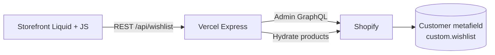

# Shopify Wishlist MVP

A production-quality customer wishlist for Shopify stores: logged-in shoppers save products from the storefront, data persists in **customer metafields**, and a **Node.js + Express** backend on **Vercel** exposes a small REST API consumed by **Dawn-compatible Liquid** theme files.

Built for the BrainX wishlist task — Express backend, Liquid frontend, metafield storage, free-tier deployment.

---

## Architecture diagram

```
┌─────────────────────────────────────────────────────────────────────────┐
│  Shopify Storefront (Dawn theme)                                        │
│  ┌──────────────────┐    ┌──────────────────────────────────────────┐ │
│  │ Product page     │    │ Wishlist page (page.wishlist template)     │ │
│  │ wishlist-button  │    │ main-wishlist section + wishlist.js/css    │ │
│  └────────┬─────────┘    └──────────────────┬───────────────────────────┘ │
│           │ fetch (customerId, secret)      │                             │
└───────────┼─────────────────────────────────┼─────────────────────────────┘
            │ HTTPS                           │
            ▼                                 ▼
┌─────────────────────────────────────────────────────────────────────────┐
│  Vercel Serverless (backend/app.js)                                     │
│  GET /api/wishlist  │  POST /add  │  DELETE /remove  │  CORS + rate limit│
└───────────────────────────────┬─────────────────────────────────────────┘
                                │ Admin GraphQL 2025-01
                                ▼
┌─────────────────────────────────────────────────────────────────────────┐
│  Shopify Admin API                                                      │
│  Customer metafield: namespace=custom, key=wishlist                     │
│  type=list.product_reference  (JSON array of product GIDs)              │
│  compareDigest for optimistic concurrency (multi-tab safe writes)       │
└─────────────────────────────────────────────────────────────────────────┘
```



---

## Tech stack

| Layer | Choice | Rationale |
|-------|--------|-----------|
| Storefront | Liquid + vanilla JS | Native Dawn integration; no build step; task requirement |
| Theme target | Dawn (latest) | Most common free theme; section/snippet patterns match its schema |
| Backend | Node 18+ / Express 4.x | Task preferred stack; minimal deps; `npm install && npm start` |
| Shopify API | Admin GraphQL `2025-01` | Spec lock; REST not used |
| HTTP client | Native `fetch` | Built into Node 18+; no axios |
| Persistence | Customer metafield | Task requirement; server-validated product references |
| Deployment | Vercel serverless | Free tier; single function via `vercel.json` |
| Testing | Node `node:test` | Zero extra test framework |
| Logging | Structured JSON `console.log` | Observable in Vercel logs; no Winston/Pino |

---

## Local setup

```bash
git clone https://github.com/YOUR_USER/brainxTest-wishlist-app.git
cd brainxTest-wishlist-app

cp .env.example backend/.env
# Edit backend/.env — fill all four variables (see below)

cd backend
npm install
npm start
# Server: http://localhost:3000
```

Run unit tests:

```bash
cd backend
npm test
```

Smoke-test the Shopify integration layer (requires real credentials):

```bash
cd backend
node scripts/smoke-test.js gid://shopify/Customer/ID gid://shopify/Product/ID
```

API curl examples: see [`backend/README.md`](backend/README.md).

---

## Shopify setup

### 1. Create a development store

1. Sign in to [Shopify Partners](https://partners.shopify.com/).
2. **Stores → Add store → Create development store**.
3. Note the store URL: `your-store.myshopify.com`.
4. Share the **collaborator request code** with your reviewer when the task is complete (Partners → Store → Manage access).

### 2. Create a custom app (Admin API token)

1. In the store admin: **Settings → Apps and sales channels → Develop apps**.
2. **Create an app** → configure **Admin API scopes**:
   - `read_customers`
   - `write_customers`
   - `read_products`
3. **Install app** → reveal **Admin API access token** (`shpat_…`).
4. Copy into `backend/.env` as `SHOPIFY_ADMIN_ACCESS_TOKEN`.

### 3. Customer metafield definition

Create a metafield definition so Shopify validates wishlist values:

| Setting | Value |
|---------|-------|
| Owner | Customer |
| Namespace | `custom` |
| Key | `wishlist` |
| Type | **List of products** (`list.product_reference`) |
| Storefront access | Optional for this MVP (API reads via Admin) |

**Admin → Settings → Custom data → Customers → Add definition**

Or via GraphQL `metafieldDefinitionCreate` if you prefer automation.

### 4. Shop metafields for theme ↔ backend wiring

Create two **shop** metafields (Settings → Custom data → Shop):

| Namespace | Key | Type | Purpose |
|-----------|-----|------|---------|
| `custom` | `wishlist_api_url` | Single line text | Deployed backend URL, e.g. `https://your-app.vercel.app` |
| `custom` | `wishlist_api_secret` | Single line text | Same value as `WISHLIST_API_SECRET` in backend env |

Generate a secret:

```bash
node -e "console.log(require('crypto').randomBytes(32).toString('hex'))"
```

### 5. Install theme files

Copy everything under `theme/` into your Dawn theme:

```
theme/assets/     → assets/
theme/snippets/   → snippets/
theme/sections/   → sections/
theme/templates/  → templates/
```

**Product page** — add inside `sections/main-product.liquid` (near the buy buttons):

```liquid

```

**Wishlist page** — Admin → **Online Store → Pages → Add page**:

- Title: `Wishlist`
- Template: `page.wishlist`
- In the theme editor, set **Wishlist API base URL** on the section (or rely on shop metafield `wishlist_api_url` on buttons).

---

## Deployment

### Vercel (backend)

1. Push this repo to GitHub (`brainxTest-wishlist-app`).
2. [vercel.com](https://vercel.com) → **Import project** → select the repo.
3. **Root directory**: repository root (uses root `vercel.json`).
4. Set environment variables (Production + Preview):

| Variable | Example |
|----------|---------|
| `SHOPIFY_STORE_DOMAIN` | `your-store.myshopify.com` |
| `SHOPIFY_ADMIN_ACCESS_TOKEN` | `shpat_…` |
| `SHOPIFY_API_VERSION` | `2025-01` |
| `WISHLIST_API_SECRET` | 64-char hex from crypto command above |

5. Deploy. Note the URL, e.g. `https://brainx-wishlist.vercel.app`.

6. Update shop metafield `custom.wishlist_api_url` with that URL.

### Post-deploy verification

```bash
curl -s https://YOUR_APP.vercel.app/health
# {"ok":true}

curl -s "https://YOUR_APP.vercel.app/api/wishlist?customerId=gid://shopify/Customer/REAL_ID"
# {"success":true,"products":[...]}
```

### GitHub PR workflow

```bash
git checkout feat/wishlist-mvp
git push -u origin feat/wishlist-mvp
gh pr create --base main --head feat/wishlist-mvp --title "Wishlist MVP" --body "BrainX wishlist task — backend + theme"
```

Share the PR link, store URL, and storefront password with the reviewer.

---

## API documentation

Base URL: `https://YOUR_APP.vercel.app` (or `http://localhost:3000` locally).

### `GET /api/wishlist?customerId={gid}`

Retrieve hydrated product cards for a customer.

**Example**

```bash
curl "https://YOUR_APP.vercel.app/api/wishlist?customerId=gid://shopify/Customer/123"
```

| Status | Body |
|--------|------|
| 200 | `{ "success": true, "products": ProductCard[] }` |
| 400 | `{ "success": false, "error": "INVALID_CUSTOMER_ID" }` |
| 404 | `{ "success": false, "error": "CUSTOMER_NOT_FOUND" }` |
| 429 | `{ "success": false, "error": "RATE_LIMITED" }` |
| 500 | `{ "success": false, "error": "SHOPIFY_API_ERROR", "detail": "..." }` |

**ProductCard**

```json
{
  "id": "gid://shopify/Product/123",
  "title": "Example Product",
  "handle": "example-product",
  "url": "https://store.com/products/example-product",
  "image": { "src": "https://...", "alt": "..." },
  "price": { "amount": "29.99", "currencyCode": "USD" },
  "available": true
}
```

### `POST /api/wishlist/add`

**Headers:** `Content-Type: application/json`, `X-Wishlist-Secret: {secret}`

**Body:** `{ "customerId": "gid://...", "productId": "gid://..." }`

| Status | Body |
|--------|------|
| 200 | `{ "success": true, "wishlist": ["gid://shopify/Product/..."] }` |
| 400 | `{ "success": false, "error": "INVALID_PAYLOAD", "field": "customerId" }` |
| 401 | `{ "success": false, "error": "INVALID_SECRET" }` |
| 404 | `{ "success": false, "error": "CUSTOMER_NOT_FOUND" }` |
| 409 | `{ "success": false, "error": "PRODUCT_ALREADY_IN_WISHLIST" }` |
| 429 | `{ "success": false, "error": "RATE_LIMITED" }` |
| 500 | `{ "success": false, "error": "SHOPIFY_API_ERROR", "detail": "..." }` |

### `DELETE /api/wishlist/remove`

Same headers and body as add.

| Status | Body |
|--------|------|
| 200 | `{ "success": true, "wishlist": [] }` |
| 404 | `{ "success": false, "error": "PRODUCT_NOT_IN_WISHLIST" }` or `CUSTOMER_NOT_FOUND` |
| 409 | `{ "success": false, "error": "WISHLIST_CONFLICT" }` (concurrent write) |

---

## Project structure

```
.
├── .env.example                 # Four required backend env vars
├── .gitignore
├── README.md                    # This file
├── vercel.json                  # Routes /api/* → backend/app.js
├── backend/
│   ├── app.js                   # Express app (Vercel + local listen)
│   ├── package.json
│   ├── README.md                # Local curl testing guide
│   ├── routes/
│   │   └── wishlist.js          # GET, POST /add, DELETE /remove
│   ├── services/
│   │   └── shopify.js           # Admin GraphQL client + typed errors
│   ├── middleware/
│   │   ├── auth.js              # X-Wishlist-Secret verification
│   │   ├── validate.js          # GID validation
│   │   ├── rateLimit.js         # 30 req/min per IP
│   │   ├── logger.js            # JSON request logs
│   │   └── errorHandler.js      # Error → HTTP status mapping
│   ├── utils/
│   │   ├── metafields.js        # Pure wishlist list helpers
│   │   └── metafields.test.js   # node:test unit tests
│   └── scripts/
│       └── smoke-test.js        # Live Shopify integration smoke test
└── theme/                       # Copy into Dawn
    ├── assets/
    │   ├── wishlist.js          # window.WishlistApp public API
    │   └── wishlist.css         # Scoped storefront styles
    ├── snippets/
    │   └── wishlist-button.liquid
    ├── sections/
    │   └── main-wishlist.liquid
    └── templates/
        └── page.wishlist.json
```

---

## Known limitations

### Unsigned customer ID (MVP auth gap)

This MVP **does not use Shopify App Proxy**, so the storefront sends `customerId` from Liquid (`gid://shopify/Customer/{{ customer.id }}`) without a cryptographic session proof. A motivated attacker who knows the shared secret could theoretically mutate another customer's wishlist by guessing GIDs.

**Mitigations in this MVP:**

| Mitigation | Implementation |
|------------|----------------|
| CORS allowlist | Backend only accepts browser requests from `https://{SHOPIFY_STORE_DOMAIN}` |
| Shared API secret | Writes require `X-Wishlist-Secret` header (injected via shop metafield) |
| Customer existence check | Backend queries Shopify before writes; random GIDs → 404 |
| Rate limiting | 30 req/min per IP (in-memory; per Vercel instance, not global) |
| Mutation logging | Every add/remove logs JSON `{ ts, customerId, productId, action, result }` |

> **For production hardening**, replace shared-secret auth with **App Proxy + HMAC signature verification**. The shared-secret approach is acceptable for this MVP because it stops casual abuse but is **not cryptographically tied to the customer session**.

### Other limitations

- **Guest wishlists** are not supported — buttons render only when `customer` is logged in.
- **Rate limits** are per serverless instance, not globally enforced across Vercel regions.
- **Add to cart** from the wishlist page uses the product's first available variant via `/products/{handle}.js`.
- **Deployment URL** must be set manually in shop/section settings until Phase 4 deploy is complete.

---

## Future improvements

1. **App Proxy + HMAC** — cryptographically bind requests to the logged-in customer session.
2. **Theme app extension** — install wishlist UI without editing Dawn source files.
3. **Webhook sync** — prune deleted products from metafields on `products/delete`.
4. **TypeScript port** — typed backend with shared API contracts.
5. **Global rate limiting** — Redis or Vercel KV for cross-instance limits.
6. **Guest wishlist** — localStorage with merge-on-login flow.
7. **Storefront API** — read wishlist without round-tripping through the backend for GET requests.
8. **Automated E2E tests** — Playwright against dev store + deployed API.

---

## Definition of done checklist

| # | Criterion | Status |
|---|-----------|--------|
| 1 | Three endpoints on deployed Vercel URL | ⏳ Deploy when ready |
| 2 | Customer add → refresh → product persists | ⏳ Requires live store |
| 3 | Two tabs adding different products (compareDigest) | ✅ Implemented |
| 4 | Wishlist page shows images, prices, Add to cart | ✅ Theme shipped |
| 5 | Add to cart updates Dawn cart drawer | ✅ AJAX + section refresh |
| 6 | Remove last item → empty state without reload | ✅ JS re-fetch |
| 7 | Network failure → toast + rollback | ✅ Optimistic UI |
| 8 | Rapid double-click aborts prior request | ✅ AbortController |
| 9 | `npm test` passes | ✅ 12 test cases |
| 10 | README has all 10 sections | ✅ This file |
| 11 | GitHub repo + feature commits | ⏳ Push + PR when ready |
| 12 | `.env` gitignored, `.env.example` committed | ✅ |
| 13 | `validate_theme` zero errors on Liquid | ✅ Phase 5 validated |

---

## License

MIT — use freely for the BrainX assessment and learning purposes.
